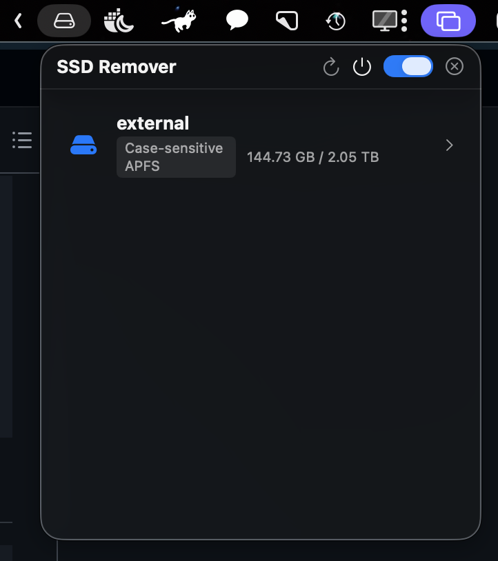
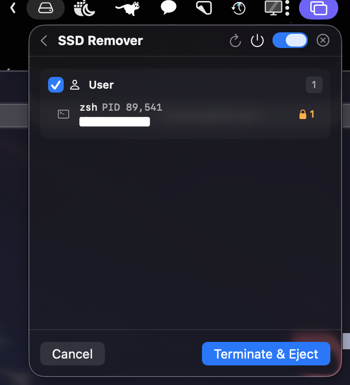

# SSD Remover

[한국어](README.ko.md)

A macOS menu bar utility that helps you safely eject external SSDs/disks.

It automatically detects processes blocking a disk, lets you selectively terminate them, and safely ejects the disk.

## Screenshots

| Volume List | Process List |
|:-:|:-:|
|  |  |

## Features

- **Menu Bar Resident** - Quick access from the menu bar icon
- **Auto-detect External Disks** - Real-time detection of connected external disks
- **Blocking Process Scan** - Identifies processes holding the disk using `lsof`
- **Process Classification** - Automatically categorizes into Spotlight, system, and user processes
- **Selective Process Termination** - Choose which processes to terminate via checkboxes
- **Graceful Shutdown** - Sends SIGTERM first, falls back to SIGKILL if needed
- **Privilege Escalation** - Requests admin privileges for root process termination
- **Spotlight Warning** - Displays a warning banner when mds/mds_stores is detected
- **Launch at Login** - Auto-launch on system startup
- **CLI Mode** - Available for terminal automation

## Installation

1. Download `SSD_Remover.zip` from the [latest release](https://github.com/eastLight210/SSD_Remover/releases/latest)
2. Unzip the file
3. Move `SSD_Remover.app` to the Applications folder
4. On first launch, if you see an "unidentified developer" warning, right-click > Open to run

### Install the CLI command (optional)

The release app contains the CLI executable. Create a stable `ssd-remover` command on `PATH`:

```bash
sudo mkdir -p /usr/local/bin
sudo ln -sfn "/Applications/SSD_Remover.app/Contents/MacOS/SSD_Remover" /usr/local/bin/ssd-remover
ssd-remover --help
```

If the app is installed somewhere else, replace `/Applications/SSD_Remover.app` with its path.
To remove only the command (the app remains installed):

```bash
sudo rm /usr/local/bin/ssd-remover
```

## Requirements

- macOS 14.0 (Sonoma) or later

## Build from Source

Requires Xcode 26.0+ and Swift 6.2.

Generate the Xcode project with [XcodeGen](https://github.com/yonaskolb/XcodeGen).

```bash
# Install XcodeGen (if not installed)
brew install xcodegen

# Generate Xcode project
xcodegen generate

# Open in Xcode
open SSD_Remover.xcodeproj
```

## Project Structure

```
SSD_Remover/
├── App/              # Entry point, bootstrap, launch mode detection
├── Models/           # ExternalVolume, BlockingProcess, ProcessGroup
├── Services/         # Shell execution, volume monitoring, process scan/terminate, disk eject
│   └── Protocols/    # Service interfaces (DI for testing)
├── ViewModels/       # AppViewModel, EjectViewModel (state machine)
├── Views/            # SwiftUI views (volume list, process list, progress)
├── Utilities/        # lsof/diskutil parsers, process classifier
├── CLI/              # CLI command parser and runner
└── Resources/        # Info.plist, Assets
```

## Architecture

Uses the **MVVM + Service Layer** pattern.

- **@Observable ViewModel** - State management and UI binding
- **Actor-based Services** - Concurrency safety with Swift Concurrency
- **Protocol-based DI** - Dependency injection for testability

## CLI Usage

```bash
# List external volumes
ssd-remover list

# Scan blockers and the files they hold
ssd-remover scan <volume-query>

# Terminate selected processes (repeat --group and --pid as needed)
ssd-remover terminate <volume-query> --group user
ssd-remover terminate <volume-query> --pid 123 --pid 456

# Preview all targets without changing anything
ssd-remover terminate-and-eject <volume-query> --dry-run

# Explicitly terminate every blocker, then eject
ssd-remover terminate-and-eject <volume-query> --all

# Eject without terminating processes
ssd-remover eject <volume-query>

# Stable machine-readable output
ssd-remover scan <volume-query> --json

# Version and help
ssd-remover version
ssd-remover help
ssd-remover terminate --help
```

`<volume-query>` accepts a device identifier, exact mount path, volume name, or a unique
case-insensitive partial match. Ambiguous matches are rejected with candidate details.

For `terminate` and `terminate-and-eject`, repeated groups are combined, repeated PIDs are
combined, and group plus PID filters form an intersection. If no filter is provided, `--all`
is required before any blocker is signaled. `--dry-run` safely prints the resolved volume and
targets without sending signals or ejecting. The default grace period is 3 seconds and can be
changed with `--grace-period <seconds>`.

CLI mode never opens a graphical administrator prompt. If the selected targets include a
root-owned process, re-run the command explicitly with `sudo`; otherwise that target fails
immediately with an actionable error. GUI mode may still request administrator authorization.

All operational commands (`list`, `scan`, `terminate`, `eject`, and `terminate-and-eject`)
support `--json`. The JSON contract has this top-level shape:

```json
{
  "schemaVersion": 1,
  "success": true,
  "command": "scan",
  "data": {}
}
```

Successful command results are written to stdout. Usage and preflight errors in JSON mode are
written as a structured object to stderr. A completed operation with per-process or eject
failures remains structured on stdout and exits nonzero. `scan` JSON includes resolved volume
metadata, process category, PID, user, UID, command, root ownership, and deduplicated locked
file paths.

Exit codes are `0` for success, `1` for runtime/operation failure, and `64` for command-line
usage errors.

## Testing

```bash
xcodebuild test -scheme SSD_Remover -destination 'platform=macOS'

# Verify a built release app can be invoked through the installed command path
script/test_cli_installation.sh \
  /path/to/SSD_Remover.app/Contents/MacOS/SSD_Remover
```

## License

MIT License
